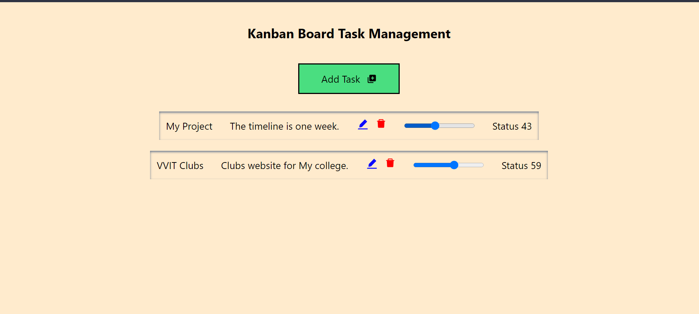
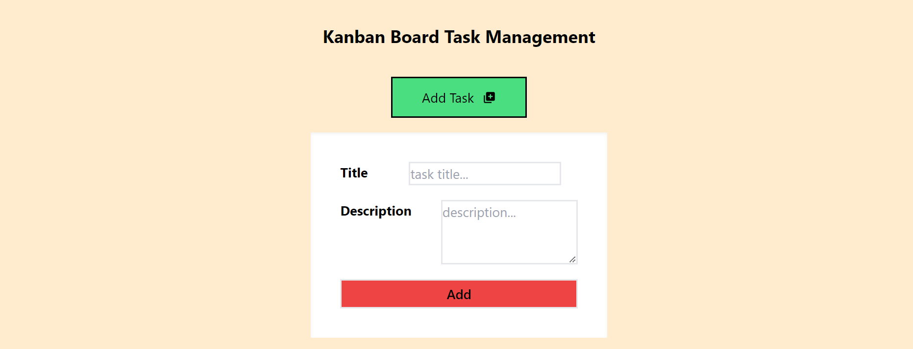
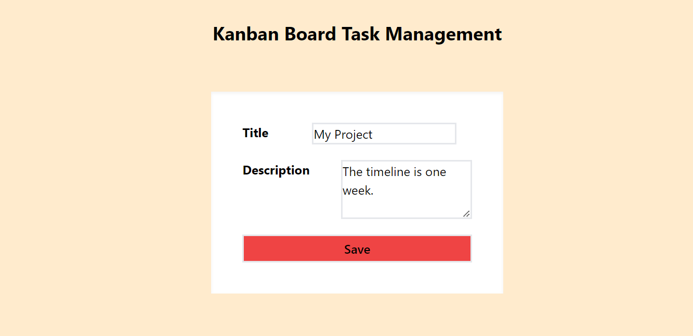
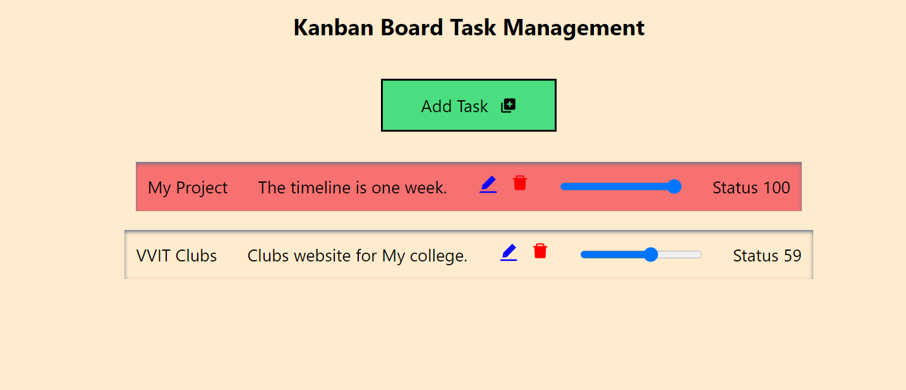
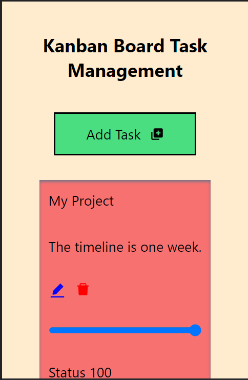

Problem Statement:
Develop a Kanban board inspired by platforms like Trello for task management. The application
should seamlessly allow users to manage tasks among different stages of completion.

Front-end Requirements:
1. Homepage: Display all tasks, segregated by their status groups: To Do, Doing, Done.
2. Task Card: Showcase the task title and description.
3. Add Task: Integrate a form to create a new task, prompting users for the title and
description of the task.
4. Edit Task: Provide an option to edit an existing task’s title and description.
5. Delete Task: Implement a feature to remove a task permanently.
6. Task Status: Empower users to effortlessly drag and drop tasks between the To Do,
Doing, and Done categories.
7. Responsive Design: Ensure the application is fully functional and visually coherent on
mobile devices.

Back-end Requirements:
1. Create an API with endpoints to support CRUD operations for tasks.
2. Tasks should be stored in a database.

In this Next.js and TypeScript project styled with Tailwind CSS, the home page displays tasks with options for editing, deleting, and status tracking. Task details are presented in an organized grid layout, while icons provide easy access to editing and deletion functionalities. A dynamic slider visually represents task completion, with a subtle underline added to completed tasks. This project showcases a user-friendly interface with clean code architecture, ensuring a seamless task management experience.

We can add tasks by clicking addTask button with task details.

We can edit tasks by clicking the edit icon at respective task. you can see the form with previous details like this.

Here we can mention the completion of task with progress bar it is dynamic you can simply track your status by dragging this, If we completed 100 % of task it shows in red colour.

It is fully responsive application, You can use this in your mobile and tablet devices also.

This is all about working and features of this application.

Github link : https://github.com/Prakash7078/Todo-App/

Live URL: https://p-todo.vercel.app/

                